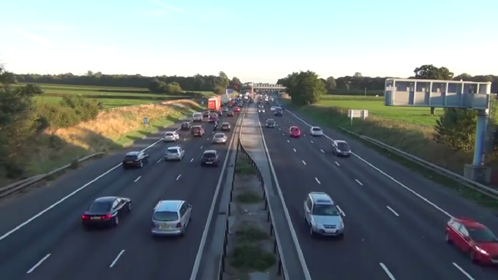

# DLA-Project
#### Objective
This project is part of the interview process for DLA at GD-MS. It is required to be done on the NVIDIA Jetson TX2 developer kit and shipped back to DLA within two weeks of receipt (ship back by 6/21/19). The objective of this project is to run a small model on the kit to identify objects.

#### Run Demo
* To run the demo, open a terminal and type `JustinDemo` and demo will complete in < 2 minutes.
* It will identify objects in a traffic video for about 20 seconds, a city walking video for about 40 seconds, and the onboard camera for about 60 seconds. While the camera is on, the user can point it at objects, such as keyboards and monitors, for identification.  

#### Procedure
* Surveying the possibilites for object detection, it seems that YOLOv3 (you only look once)**[1](https://arxiv.org/pdf/1804.02767v1.pdf)** is a fast real-time object detector and also has a model for systems with limited resources YOLOv3-tiny). It should be noted that there are more accurate models, but yolov3 is faster.
* From the YOLOv3 paper, we see it is faster than other models, such as RetinaNet and SSD (single shot detection)
  
* Survey literature and the web for code already written and models already for small scale YOLO
* yolov3 9000+classes, 106 layers
* yolov3-tiny 80 classes
* Clone repositories
* Install necessary software
* Configure hardware and software
* Run demo to identify objects
YOLO (you only look once) model on the kit and identify objects in a two videos and through the onboard camera.

#### Shipped Hardware and Software
* NVIDIA Jetson TX2 Developer kit
  * 256-core NVIDIA Pascal (Tegra) GPU
  * ARMv8 64-bit CPU complex
    * Dual-core NVIDIA Denver 2
    * Quad-core ARM Cortex-A57
  * 8GB 128-bit LPDDR4
  * 5MP CSI camera module (with Omnivision OV5693)
* Jetpack 4.2 
  * LTS Kernel 4.9
  * Jetson.GPIO Python library
  * Opencv 3.3.1
  * Gstreamer 1.0
  

#### Results
* In surveying the web, instructions for running the TX2 using yolov2 (you only look once) darknet was found **[here](https://jkjung-avt.github.io/yolov2/)**.
* The repository with the yolov2 pretrained weights were downloaded from **[https://github.com/pjreddie/darknet](https://github.com/pjreddie/darknet).**
* The first few lines of `Makefile` was updated to reflect TX2 hardware configuration.
* In the demo repo, a webcam was used, but it is requred by DLA to only use hardware available on the Jetson, so more digging was required.
* Download the pre-trained weights with `wget https://pjreddie.com/media/files/yolov3.weights`
* As the darknet repo was explored, it was noticed that there was a yolov3 was available. The instructions for that setup is **[https://jkjung-avt.github.io/yolov3/](https://jkjung-avt.github.io/yolov3/)** 
* Opencv 3.3.1 came with Jetpack, but version 3.4.* is required for gstreamer functionality. Install instructions are here **[https://jkjung-avt.github.io/opencv-on-nano/](https://jkjung-avt.github.io/opencv-on-nano/)**
* The specify the Jetson hardware setup and apparently to use the GPU, the `Makefile` script was modified from
```
GPU=0
CUDNN=0
OPENCV=0

ARCH= -gencode arch=compute_30,code=sm_30 \
      -gencode arch=compute_35,code=sm_35 \
      -gencode arch=compute_50,code=[sm_50,compute_50] \
      -gencode arch=compute_52,code=[sm_52,compute_52]
```
to this

```
GPU=1
CUDNN=1
OPENCV=1
......
ARCH= -gencode arch=compute_53,code=[sm_53,compute_53] \
-gencode arch=compute_62,code=[sm_62,compute_62]
```
* A traffic video for object identification was downloaded in 720p in mp4 format using this command : `youtube-dl -f 18 https://www.youtube.com/watch?v=wqctLW0Hb_0&feature=youtu.be`

* On the first run, the hardware/software setup could not run with the weights from the full model. See output below:
```
learner@dla-tx2-004:~/Documents/DLA-Project-master/yolov3$ ./darknet detector demo cfg/coco.data cfg/yolov3.cfg yolov3.weights traffic1.mp4
Demo
layer     filters    size              input                output
    0 conv     32  3 x 3 / 1   608 x 608 x   3   ->   608 x 608 x  32  0.639 BFLOPs
    1 conv     64  3 x 3 / 2   608 x 608 x  32   ->   304 x 304 x  64  3.407 BFLOPs
    2 conv     32  1 x 1 / 1   304 x 304 x  64   ->   304 x 304 x  32  0.379 BFLOPs
    3 conv     64  3 x 3 / 1   304 x 304 x  32   ->   304 x 304 x  64  3.407 BFLOPs
    4 res    1                 304 x 304 x  64   ->   304 x 304 x  64
    5 conv    128  3 x 3 / 2   304 x 304 x  64   ->   152 x 152 x 128  3.407 BFLOPs
    6 conv     64  1 x 1 / 1   152 x 152 x 128   ->   152 x 152 x  64  0.379 BFLOPs
    7 conv    128  3 x 3 / 1   152 x 152 x  64   ->   152 x 152 x 128  3.407 BFLOPs
    8 res    5                 152 x 152 x 128   ->   152 x 152 x 128
....
   59 conv    256  1 x 1 / 1    38 x  38 x 512   ->    38 x  38 x 256  0.379 BFLOPs
   60 conv    512  3 x 3 / 1    38 x  38 x 256   ->    38 x  38 x 512  3.407 BFLOPs
   61 res   58                  38 x  38 x 512   ->    38 x  38 x 512
   62 conv   1024  3 x 3 / 2    38 x  38 x 512   ->    19 x  19 x1024  3.407 BFLOPs
   63 conv    512  1 x 1 / 1    19 x  19 x1024   ->    19 x  19 x 512  0.379 BFLOPs
   64 Killed
learner@dla-tx2-004:~/Documents/DLA-Project-master/yolov3$ 
```
* With further exploration, a yolov3-tiny model was discovered in the repo. Pre-trained weights downloaded with `wget https://pjreddie.com/media/files/yolov3-tiny.weights` and was ran with traffic video: `$./darknet detector demo cfg/coco.data cfg/yolov3-tiny.cfg yolov3.weights traffic1.mp4` with this structure:
```
learner@dla-tx2-004:~/Documents/DLA-Project-master/yolov3$ ./darknet detector demo cfg/coco.data cfg/yolov3-tiny.cfg yolov3.weights traffic1.mp4
Demo
layer     filters    size              input                output
    0 conv     16  3 x 3 / 1   416 x 416 x   3   ->   416 x 416 x  16  0.150 BFLOPs
    1 max          2 x 2 / 2   416 x 416 x  16   ->   208 x 208 x  16
    2 conv     32  3 x 3 / 1   208 x 208 x  16   ->   208 x 208 x  32  0.399 BFLOPs
    3 max          2 x 2 / 2   208 x 208 x  32   ->   104 x 104 x  32
    4 conv     64  3 x 3 / 1   104 x 104 x  32   ->   104 x 104 x  64  0.399 BFLOPs
    5 max          2 x 2 / 2   104 x 104 x  64   ->    52 x  52 x  64
    6 conv    128  3 x 3 / 1    52 x  52 x  64   ->    52 x  52 x 128  0.399 BFLOPs
    7 max          2 x 2 / 2    52 x  52 x 128   ->    26 x  26 x 128
    8 conv    256  3 x 3 / 1    26 x  26 x 128   ->    26 x  26 x 256  0.399 BFLOPs
    9 max          2 x 2 / 2    26 x  26 x 256   ->    13 x  13 x 256
   10 conv    512  3 x 3 / 1    13 x  13 x 256   ->    13 x  13 x 512  0.399 BFLOPs
   11 max          2 x 2 / 1    13 x  13 x 512   ->    13 x  13 x 512
   12 conv   1024  3 x 3 / 1    13 x  13 x 512   ->    13 x  13 x1024  1.595 BFLOPs
   13 conv    256  1 x 1 / 1    13 x  13 x1024   ->    13 x  13 x 256  0.089 BFLOPs
   14 conv    512  3 x 3 / 1    13 x  13 x 256   ->    13 x  13 x 512  0.399 BFLOPs
   15 conv    255  1 x 1 / 1    13 x  13 x 512   ->    13 x  13 x 255  0.044 BFLOPs
   16 yolo
   17 route  13
   18 conv    128  1 x 1 / 1    13 x  13 x 256   ->    13 x  13 x 128  0.011 BFLOPs
   19 upsample            2x    13 x  13 x 128   ->    26 x  26 x 128
   20 route  19 8
   21 conv    256  3 x 3 / 1    26 x  26 x 384   ->    26 x  26 x 256  1.196 BFLOPs
   22 conv    255  1 x 1 / 1    26 x  26 x 256   ->    26 x  26 x 255  0.088 BFLOPs
   23 yolo
Loading weights from yolov3.weights...Done!
video file: traffic1.mp4
```
* However, no object boxes were displayed and no identifications were made.

* After reviewing the yolov2 tiny model implementation, it became apparent that the full model weights cannot be used, so the yolov3 tiny weights were dowloaded with the command `wget https://pjreddie.com/media/files/yolov3-tiny.weights`.
* Then the command `./darknet detector demo cfg/coco.data cfg/yolov3-tiny.cfg yolov3-tiny.weights traffic1.mp4` was executed and it worked. Objects were identified in the video as shown in this screen shot:

* In the above screenshot, the probabilities for the object identification range from 0.52 to 0.77 with 14.9 fps.
* Another video was downloaded, `youtube-dl -f 18 https://www.youtube.com/watch?v=NyLF8nHIquM`, to test the object detector. Other objects were identified as shown in this screen shot:

* Here people and traffic lights are detected with probabilites from 0.56 to 0.97.
* To get demo down to 2 minutes, tried to install a video editor to cut videos down to 1 minute each and then combine them. Three different ways to install a avidemux was tried, but none worked. The ways were with using tar.gz, appimage, and Flatpak.
* Instead of editing the videos, the `timeout` command was used in a script to run each video for less than 1m. Demo is now  leass than 2m when a terminal window is opened and the command `JustinDemo` is executed.
* To open a camera capture window, the command `gst-launch-1.0 nvcamerasrc ! 'video/x-raw(memory:NVMM),width=640, height=480, framerate=30/1, format=NV12' ! nvvidconv flip-method=2 ! nvegltransform ! nveglglessink -e` should work according to several websites. But when it is executed to try to open camera capture window, get error `WARNING: erroneous pipeline: no element "nvcamerasrc"`
* Upon further research, `nvcamerasrc` is deprecated and `gst-launch-1.0 nvarguscamerasrc ! nvvidconv ! xvimagesink` was used succesfully.
* With this information, to use the camera for object detection, this command was tried `sudo ./darknet detector demo cfg/coco.data cfg/yolov3-tiny.cfg yolov3-tiny.weights "nvarguscamerasrc ! video/x-raw(memory:NVMM), width=640, height=480, framerate=30/1, format=NV12' ! nvvidconv flip-method=0 ! nvegltransform ! nveglglessink -e ! appsink"` and to a picture and not a streaming video.
* This command resulted in the live onboard camera feed that used yolo to identify objects: `./darknet detector demo cfg/coco.data cfg/yolov3-tiny.cfg yolov3-tiny.weights "nvarguscamerasrc ! video/x-raw(memory:NVMM), width=(int)640, height=(int)480,format=(string)NV12, framerate=(fraction)24/1 ! nvvidconv flip-method=0 ! video/x-raw, format=(string)BGRx ! videoconvert ! video/x-raw, format=(string)BGR ! appsink"`


