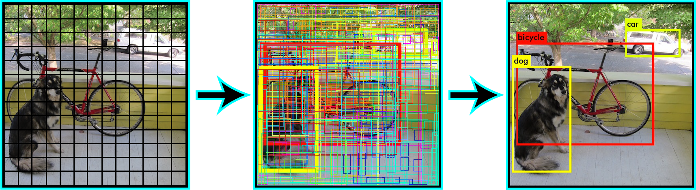

# DLA-Project
#### Objective
This project is part of the interview process for DLA (deep learning analytics). It is required to be done on the NVIDIA Jetson TX2 developer kit and shipped back to DLA within two weeks of receipt (ship back by 6/21/19). Project choice is up to the applicant. For this one, the objective is to run a model on the kit to identify objects.

#### Run Demo
* To run the demo, open a terminal on the Jetson TX2 and type `$ JustinDemo` and it will complete in < 2 minutes.
* It will identify objects in a traffic video for about 20 seconds, a city walking video for about 40 seconds, and the onboard camera for about 60 seconds. While the camera is on, the user can point it at objects, such as keyboards and monitors, for identification.  

#### Procedure
* Survey literature and other sources on the web
* Clone repositories
* Install necessary software
* Configure hardware and software
* Run demo to identify objects in two videos and using the onboard camera

#### Received Hardware and Software
* NVIDIA Jetson TX2 Developer kit
  * 256-core NVIDIA Pascal (Tegra) GPU
  * ARMv8 64-bit CPU complex
    * Dual-core NVIDIA Denver 2
    * Quad-core ARM Cortex-A57
  * 8GB 128-bit LPDDR4
  * 5MP CSI camera module (with Omnivision OV5693)
* Jetpack 4.2 
  * LTS Kernel 4.9
  * Jetson.GPIO Python library
  * Opencv 3.3.1
  * Gstreamer 1.0
  
  

#### Results
* Surveying the possibilites for object detection, it seems that YOLOv3 (you only look once)**[[1]](#ref1)** is a fast real-time object detector and also has a model for systems with limited resources (YOLOv3-tiny). It should be noted that there are more accurate models, but YOLOv3 is faster.
* From the YOLOv3 paper, we see it is faster than other models, such as RetinaNet and SSD (single shot detection) on the COCO (common objects in context) database:


* The y-axis is COCO AP (average precision).
* Instead of starting with a classifier and converting it into a real-time object detector using sliding boxes, YOLO takes in the whole image at once and divides it up into a grid. After that, it identifies bounding boxes, areas of the grid where an object might be. Then it classifies the bounding boxes with the highest probabilities of containing an object. The progression can be seen below, taken from **[https://pjreddie.com/darknet/yolov2/](https://pjreddie.com/darknet/yolov2/)**



* YOLO is built on Darknet, which is a neural network framework writtin in C and CUDA. The following procedure for installing Darknet and using YOLOv3 basically follows these steps **[https://pjreddie.com/darknet/](https://pjreddie.com/darknet/)**. This blog was also helpful: **[https://jkjung-avt.github.io/yolov3/](https://jkjung-avt.github.io/yolov3/)**.
* Download the YOLOv3 model, weights, and tiny weights: 
```
$ git clone https://github.com/pjreddie/darknet yolov3
$ wget https://pjreddie.com/media/files/yolov3.weights
$ wget https://pjreddie.com/media/files/yolov3-tiny.weights
```
* Opencv 3.3.1 came with Jetpack 4.2, but Opencv version 3.4.* is required for Gstreamer functionality to use the onboard camera. Install instructions are here **[https://jkjung-avt.github.io/opencv-on-nano/](https://jkjung-avt.github.io/opencv-on-nano/)**
* To specify the Jetson hardware setup and to use the GPU, the `Makefile` script was modified from
```
GPU=0
CUDNN=0
OPENCV=0

ARCH= -gencode arch=compute_30,code=sm_30 \
      -gencode arch=compute_35,code=sm_35 \
      -gencode arch=compute_50,code=[sm_50,compute_50] \
      -gencode arch=compute_52,code=[sm_52,compute_52]
```
to this

```
GPU=1
CUDNN=1
OPENCV=1
......
ARCH= -gencode arch=compute_53,code=[sm_53,compute_53] \
-gencode arch=compute_62,code=[sm_62,compute_62]
```
* Build the code with the `$ make` command at the terminal prompt.
* `youtube-dl` was installed and a traffic video for object identification was downloaded from Youtube in in mp4 format using this command : `$ youtube-dl -f 18 https://www.youtube.com/watch?v=wqctLW0Hb_0&feature=youtu.be`

* On the first run, the hardware/software setup could not run with the weights from the full model. See output below:
```
learner@dla-tx2-004:~/Documents/DLA-Project-master/yolov3$ ./darknet detector demo cfg/coco.data cfg/yolov3.cfg yolov3.weights traffic1.mp4
Demo
layer     filters    size              input                output
    0 conv     32  3 x 3 / 1   608 x 608 x   3   ->   608 x 608 x  32  0.639 BFLOPs
    1 conv     64  3 x 3 / 2   608 x 608 x  32   ->   304 x 304 x  64  3.407 BFLOPs
    2 conv     32  1 x 1 / 1   304 x 304 x  64   ->   304 x 304 x  32  0.379 BFLOPs
    3 conv     64  3 x 3 / 1   304 x 304 x  32   ->   304 x 304 x  64  3.407 BFLOPs
    4 res    1                 304 x 304 x  64   ->   304 x 304 x  64
    5 conv    128  3 x 3 / 2   304 x 304 x  64   ->   152 x 152 x 128  3.407 BFLOPs
    6 conv     64  1 x 1 / 1   152 x 152 x 128   ->   152 x 152 x  64  0.379 BFLOPs
    7 conv    128  3 x 3 / 1   152 x 152 x  64   ->   152 x 152 x 128  3.407 BFLOPs
    8 res    5                 152 x 152 x 128   ->   152 x 152 x 128
....
   59 conv    256  1 x 1 / 1    38 x  38 x 512   ->    38 x  38 x 256  0.379 BFLOPs
   60 conv    512  3 x 3 / 1    38 x  38 x 256   ->    38 x  38 x 512  3.407 BFLOPs
   61 res   58                  38 x  38 x 512   ->    38 x  38 x 512
   62 conv   1024  3 x 3 / 2    38 x  38 x 512   ->    19 x  19 x1024  3.407 BFLOPs
   63 conv    512  1 x 1 / 1    19 x  19 x1024   ->    19 x  19 x 512  0.379 BFLOPs
   64 Killed
learner@dla-tx2-004:~/Documents/DLA-Project-master/yolov3$ 
```
* There are 106 layers and can identify 9000+ classes. Jetson could not handle such a large model.
* YOLOv3-tiny has 23 layers and can identify 80 classes.
 The smaller model was run with the traffic video: `$ ./darknet detector demo cfg/coco.data cfg/yolov3-tiny.cfg yolov3-tiny.weights traffic1.mp4` with this structure:
```
layer     filters    size              input                output
    0 conv     16  3 x 3 / 1   416 x 416 x   3   ->   416 x 416 x  16  0.150 BFLOPs
    1 max          2 x 2 / 2   416 x 416 x  16   ->   208 x 208 x  16
    2 conv     32  3 x 3 / 1   208 x 208 x  16   ->   208 x 208 x  32  0.399 BFLOPs
    3 max          2 x 2 / 2   208 x 208 x  32   ->   104 x 104 x  32
    4 conv     64  3 x 3 / 1   104 x 104 x  32   ->   104 x 104 x  64  0.399 BFLOPs
    5 max          2 x 2 / 2   104 x 104 x  64   ->    52 x  52 x  64
    6 conv    128  3 x 3 / 1    52 x  52 x  64   ->    52 x  52 x 128  0.399 BFLOPs
    7 max          2 x 2 / 2    52 x  52 x 128   ->    26 x  26 x 128
    8 conv    256  3 x 3 / 1    26 x  26 x 128   ->    26 x  26 x 256  0.399 BFLOPs
    9 max          2 x 2 / 2    26 x  26 x 256   ->    13 x  13 x 256
   10 conv    512  3 x 3 / 1    13 x  13 x 256   ->    13 x  13 x 512  0.399 BFLOPs
   11 max          2 x 2 / 1    13 x  13 x 512   ->    13 x  13 x 512
   12 conv   1024  3 x 3 / 1    13 x  13 x 512   ->    13 x  13 x1024  1.595 BFLOPs
   13 conv    256  1 x 1 / 1    13 x  13 x1024   ->    13 x  13 x 256  0.089 BFLOPs
   14 conv    512  3 x 3 / 1    13 x  13 x 256   ->    13 x  13 x 512  0.399 BFLOPs
   15 conv    255  1 x 1 / 1    13 x  13 x 512   ->    13 x  13 x 255  0.044 BFLOPs
   16 yolo
   17 route  13
   18 conv    128  1 x 1 / 1    13 x  13 x 256   ->    13 x  13 x 128  0.011 BFLOPs
   19 upsample            2x    13 x  13 x 128   ->    26 x  26 x 128
   20 route  19 8
   21 conv    256  3 x 3 / 1    26 x  26 x 384   ->    26 x  26 x 256  1.196 BFLOPs
   22 conv    255  1 x 1 / 1    26 x  26 x 256   ->    26 x  26 x 255  0.088 BFLOPs
   23 yolo
Loading weights from yolov3-tiny.weights...Done!
video file: traffic1.mp4
```

* Here is a screen shot from the video as objects were identified:


* In the above screenshot, the probabilities for the object identification range from 0.52 to 0.77 with 14.9 fps.
* Another video was downloaded, `$ youtube-dl -f 18 https://www.youtube.com/watch?v=NyLF8nHIquM`, to test the object detector. Other objects were identified as shown in this screen shot:


* Here people and traffic lights are detected with probabilites from 0.56 to 0.97.
* Getting the onboard camera activated and identifying objects was not straightforward. After reading several sites and some trial and error, the correct command was found: 
```
$ ./darknet detector demo cfg/coco.data cfg/yolov3-tiny.cfg yolov3-tiny.weights "nvarguscamerasrc ! video/x-raw(memory:NVMM), width=(int)640, height=(int)480,format=(string)NV12, framerate=(fraction)24/1 ! nvvidconv flip-method=0 ! video/x-raw, format=(string)BGRx ! videoconvert ! video/x-raw, format=(string)BGR ! appsink"
```
* Here is a screenshot of the onboard camera detecting objects:


* To get the demo to be < 2min, this JustinDemo script was written and stored in the bin directory:
```
#!/bin/bash
# Object detection demo
# Justin McBride
# 6/14/19

cd Documents/DLA/yolov3
timeout 19s ./darknet detector demo cfg/coco.data cfg/yolov3-tiny.cfg yolov3-tiny.weights traffic.mp4
timeout 39s ./darknet detector demo cfg/coco.data cfg/yolov3-tiny.cfg yolov3-tiny.weights LondonWalk.mp4
timeout 59s ./darknet detector demo cfg/coco.data cfg/yolov3-tiny.cfg yolov3-tiny.weights "nvarguscamerasrc ! video/x-raw(memory:NVMM), width=(int)640, height=(int)480,format=(string)NV12, framerate=(fraction)24/1 ! nvvidconv flip-method=0 ! video/x-raw, format=(string)BGRx ! videoconvert ! video/x-raw, format=(string)BGR ! appsink"
```
* To run the demo, open a terminal and at the prompt type `$ JustinDemo`.

#### Summary
This demo showed object detection on an embedded platform. I appreciated being loaned the developer kit and the opportunity to learn more about GitHub, Linux, and computer vision. It is an ever expanding field and hope that I will get the opportunity to further my knowledge in this area and help DLA and its customers solve problems and save lives.

#### Reference
<a name="ref1">
[1] J. Redmon and A. Farhadi. Yolov3: An incremental improvement. arXiv, 2018.
</a>


